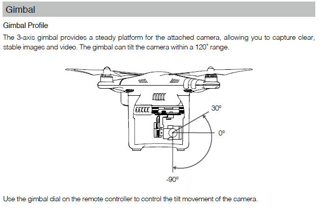

# CEA DJI Controller

## Using the Local Mission Module

The Local Mission modules performs flights in non-gps environments. It uses the Virtual Stick system to send direct movement controls to the aircraft. 

Missions should be exported from a planning software in as a JSON file, using the format outlined below. 

The Android app loads missions over HTTP, within a local network or hotspot created by the mobile device. This has been tested with the [LocalHTTPMission](https://github.com/cea-ethz/LocalHTTPMission) tool. The tool serves the last JSON file dropped onto its window, on the listed IP address. 

## Playing a standard mission
- Set the aircraft on the landing platform facing the local '0' angle. 
- Press 'Calibrate' to store this angle and altitude
- Press 'Mission Load' to read a mission from the laptop
- Press 'Enable Virtual Stick'
- Press 'Take Off'
- Press 'Mission Start'

To immediately stop the aircraft while playing a mission, move the mode switch on the left side of the physical controller out of the P position - this will cause the aircraft to hover. 

### Interface
[Interface](docs/images/interface_annotated.png)
1. Camera Preview
2. Current yaw heading relative to calibrated pose
3. Current elevation relative to takeoff height
4. Current aircraft velocity as reported by sensor
5. Current position of aircraft in local coordinates, as estimated by integrating the velocity values
6. Current values being sent to the Virtual Stick interface. 
7. Current GPS location if available
8. Current state of the current mission, and current event
9. User controls
..* Calibrate : Stores the current yaw heading and altitude as zero values
..* Mission Load : Reads a mission from the local HTTP server
..* Mission Start : Starts running the loaded mission
..* Mission Stop : Stops playing the current mission
..* Enable Virtual Stick : The aircraft will respond to Virtual Stick commands. Most physical controller functions will not work. 
..* Disable Virtual Stick : The aircraft will ignore movement commands from the app, the physical controller will become functional again. Use as a non-emergency stop if the aircraft is not moving correctly. 
..* Take Off : Aircraft will take off and hover at 1 meter
10. Overview of the currently loaded mission


### Local Mission JSON Format
A mission file consists of a mission name and an array of event objects. Each event object consists of a type, and one or two data arguments specifying the event. For a full example of all currently implemented event types, see [test_complete.json](missions/test_complete.json). This mission flies the aircraft in a small square while taking pictures facing the center point. 

~~~json
{
	"mission_name": "test_mission",
	"events": [
		{
			"type": "EVENT_TYPE",
			"data0": 0
			"data1": 0
		}
	]
}
~~~

#### Event Types

##### GO_TO
data0 : X Coordinate
data1 : Y Coordinate

Flies the aircraft in a straight line to the local coordinates (meters) described in data0 and data1. Does not change the yaw heading. Standard speed is at 1m/s. 

##### ALTITUDE
data0 : Aircraft altitude in meters

Sets the current altitude of the aircraft (meters). Note this is currently measured using the internal barometer, relative to the altitude measured during calibration. . 

##### AIM_AT
data0 : Aircraft yaw heading in degrees

Sets the yaw heading of the aircraft in degrees, relative to the heading set during calibration. Valid values are from -180 to 180, values increasing clockwise. 

##### GIMBAL
data0 : Gimbal pitch angle in degrees

Sets the pitch angle of the camera gimbal in degrees, relative to 0° pointing forward. Valid values range from -90° (down) to 30°(slightly up). 



##### PHOTO

Captures a photo at the current aircraft and gimbal heading


## Development

### SDK Key
To connect to SDK, create file res/values/api-keys.xml containing:
```xml
<resources>
    <string name="dji_api_key">API_KEY_HERE</string>
</resources>
```

# DJI Mobile SDK for Android Latest Version 4.16.1 (Original SDK Readme)

## What Is This?

The DJI Mobile SDK enables you to automate your DJI Product. You can control flight, and many subsystems of the product including the camera and gimbal. Using the Mobile SDK, create a customized mobile app to unlock the full potential of your DJI aerial platform.

## Integration

Declare dependency via Maven:

~~~xml
<dependency>
    <groupId>com.dji</groupId>
    <artifactId>dji-sdk</artifactId>
    <version>4.16.1</version>
</dependency>

<dependency>
    <groupId>com.dji</groupId>
    <artifactId>dji-sdk-provided</artifactId>
    <version>4.16.1</version>
</dependency>
~~~

or Gradle:

~~~groovy
compile 'com.dji:dji-sdk:4.16.1'
provided 'com.dji:dji-sdk-provided:4.16.1'
~~~

For further detail on how to integrate the DJI Android SDK into your Android Studio project, please check the [Integrate SDK into Application](http://developer.dji.com/mobile-sdk/documentation/application-development-workflow/workflow-integrate.html#import-maven-dependency) tutorial.

## Running the SDK Sample Code

Developers can [run the sample application](https://developer.dji.com/mobile-sdk/documentation/quick-start/index.html#android-sample-app) to immediately run code and see how the DJI Mobile SDK can be used.

One of DJI's aircraft or handheld cameras will be required to run the sample application.

## Development Workflow 

From registering as a developer, to deploying an application, the following will take you through the full Mobile SDK Application development process:

- [Prerequisites](https://developer.dji.com/mobile-sdk/documentation/application-development-workflow/workflow-prerequisits.html)
- [Register as DJI Developer & Download SDK](https://developer.dji.com/mobile-sdk/documentation/application-development-workflow/workflow-register.html)
- [Integrate SDK into Application](https://developer.dji.com/mobile-sdk/documentation/application-development-workflow/workflow-integrate.html)
- [Run Application](https://developer.dji.com/mobile-sdk/documentation/application-development-workflow/workflow-run.html)
- [Testing, Profiling & Debugging](https://developer.dji.com/mobile-sdk/documentation/application-development-workflow/workflow-testing.html)
- [Deploy](https://developer.dji.com/mobile-sdk/documentation/application-development-workflow/workflow-deploy.html)

## Sample Projects & Tutorials

Several Android tutorials are provided as examples on how to use different features of the Mobile SDK and debug tools includes:

- [Application Activation and Aircraft Binding](http://developer.dji.com/mobile-sdk/documentation/android-tutorials/ActivationAndBinding.html)
- [Getting Started with UX SDK](http://developer.dji.com/mobile-sdk/documentation/android-tutorials/UXSDKDemo.html)
- [Camera Application](https://developer.dji.com/mobile-sdk/documentation/android-tutorials/FPVDemo.html)
- [MapView and Waypoint Application (GaodeMap)](https://developer.dji.com/mobile-sdk/documentation/android-tutorials/GSDemo-Gaode-Map.html)
- [MapView and Waypoint Application (GoogleMap)](https://developer.dji.com/mobile-sdk/documentation/android-tutorials/GSDemo-Google-Map.html)
- [TapFly and ActiveTrack Application](https://developer.dji.com/mobile-sdk/documentation/android-tutorials/P4MissionsDemo.html)
- [Simulator Application](http://developer.dji.com/mobile-sdk/documentation/android-tutorials/SimulatorDemo.html)
- [GEO System Application](http://developer.dji.com/mobile-sdk/documentation/android-tutorials/GEODemo.html)

## Learn More about DJI Products and the Mobile SDK

Please visit [DJI Mobile SDK Documentation](https://developer.dji.com/mobile-sdk/documentation/introduction/index.html) for more details.

## DJI Mobile UX SDK

DJI Mobile UX SDK is a suite of product agnostic UI objects that fast tracks the development of iOS applications using the DJI Mobile SDK. For more details, please check [here](https://github.com/dji-sdk/Mobile-UXSDK-Android).

## Device Health Information Json File

You can find the **hms.json** and **`hms_match_sdkerror.json`** files in this repo's root folder.

It contains error code and detailed description for device components. Only supported by some components of Matrice 300 RTK and Zenmuse H20 series.

It is recommended to use device health information to replace old diagnostics for flight controller and RTK. There will be a few duplicated component error for gimbal, battery, perception module on Matrice 300 RTK.

Please refer to the table below for duplicated error:

| DJIDiagnosticsError | Enum Value | AlarmId |
|:------------- |:---------------:| -------------:|
| `BATTERY_DISCHARGE_OVER_CURRENT`  | 3001 | 0x110B0001|
| `BATTERY_DISCHARGE_OVER_HEAT` | 3002  | 0x110B0002 |
| `BATTERY_LOW_TEMPERATURE` | 3003  | 0x110B0003 |
| `BATTERY_CELL_BROKEN` | 3004 | 0x110B0006 |
| `GIMBAL_CONNECT_TO_FC_ERROR` | 2005 | 0x1D030001 |
| `GIMBAL_GYROSCOPE_ERROR` | 2001 | 0x1D040002 |
| `GIMBAL_PITCH_ERROR` | 2002 | 0x1D040004 |
| `GIMBAL_ROLL_ERROR` | 2003 | 0x1D040003 |
| `GIMBAL_YAW_ERROR` | 2004 | 0x1D040005 |


## ProGuard

If you're planning on optimizing your app with [ProGuard](https://developer.android.com/studio/build/shrink-code.html), you can add the following rules to your app's `proguard.cfg` file:

- For **AAR** file, please use the following rule:

~~~
"-libraryjars ./PATH_TO_THIS_FILE/dji_android_sdk.aar"
~~~

- For **API Library** folder, please use the rules in [proguard-project](<https://github.com/dji-sdk/Mobile-SDK-Android/blob/master/Sample Code/app/proguard-rules.pro>) file. 

> **Note**: There are two types of DJI Android SDK: **AAR** and **API Library folder**, you can download them from DJI Developer Website: <http://developer.dji.com/mobile-sdk/downloads/>.

## SDK Keys

SDK Keys can be used as an alternative interface to access the product.

A detailed introduction for SDK Keys is [here](./docs/README-KeyedInterface.md).

## Missions Refactor

Missions are an important part of the SDK as they allow developers to automate DJI's products using a simple, high level interface. In 4.0, missions are being refactored to be more robust and easier to manage.

A detailed introduction for missions is [here](./docs/README-Mission.md).

## Android Bridge App

Please check this [link](https://github.com/dji-sdk/Android-Bridge-App) to download the apk of the Android Bridge App apk file.

## SDK API Reference

[**Android SDK API Documentation**](http://developer.dji.com/api-reference/android-api/index.html)

## License

The DJI Android SDK is dynamically linked with unmodified libraries of <a href=http://ffmpeg.org>FFmpeg</a> licensed under the <a href=https://www.gnu.org/licenses/lgpl-3.0.html.en>LGPLv3.0</a>. The source code of these FFmpeg libraries, the compilation instructions, and the LGPL v3.0 license are provided in [Github](https://github.com/dji-sdk/FFmpeg).

The DJI Android SDK is dynamically linked with unmodified libraries of <a href=https://mvnrepository.com/artifact/com.vividsolutions/jts/1.8>JTS Topology Suite</a> licensed under the <a href=https://www.gnu.org/licenses/lgpl-3.0.html.en>LGPLv3.0</a>.

## Support

You can get support from DJI with the following methods:

- Post questions in DJI Developer Forums:
[**Chinese Forum**](https://djisdksupport.zendesk.com/hc/zh-cn/community/topics)
, [**English Forum**](https://djisdksupport.zendesk.com/hc/en-us/community/topics)

## Join Us

DJI is looking for all kinds of Software Engineers to continue building the Future of Possible. Available positions in Shenzhen, China and around the world. If you are interested, please send your resume to <software-sz@dji.com>. For more details, and list of all our global offices, please check <https://we.dji.com/jobs_en.html>.

DJI 招软件工程师啦，based在深圳，如果你想和我们一起把DJI产品做得更好，请发送简历到 <software-sz@dji.com>.  或者在这里提交您的简历：https://we.dji.com/zh-CN/position/detail?positionId=1382258951346253824 更多岗位详情请浏览 <https://we.dji.com/zh-CN/social>.
